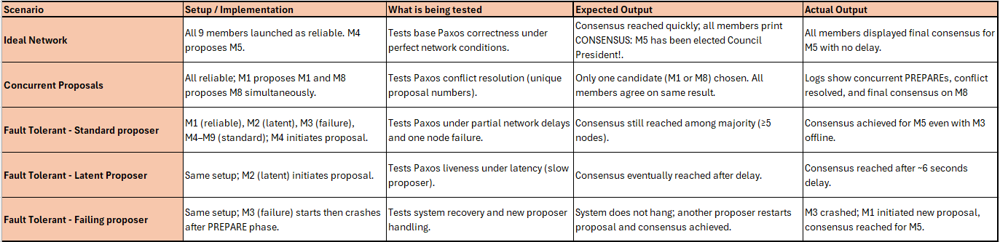

# Paxos Council - Distributed Consensus Simulation

**Author**
---------------------------------------
---------------------------------------
Nethmi Malsha Ranathunga (a1895261)

**Design** 
---------------------------------------
---------------------------------------

This project simulates a distributed consensus protocol based on Paxos, one of the most fundamental algorithms in fault-tolerant distributed systems.

In a distributed environment, several independent nodes must agree on single decision even when some nodes are delayed, disconnected or fail entirely. 

The paxos council demonstrates how consensus can still be achieved through message based coordination and majority agreement (Quorum). 

Each of the n ine nodes (M1-M9) acts as a council member that can take on three logical roles:

**Proposer** : Initiates proposals for a candidate value (PresidentID). 

**Acceptor**: Decides whether to promise or accept proposal based on Paxos rules. 

**Learner**: Observes accepted messages and announces final consensus. 

The goal is to ensure that:

**Safety**: No two nodes decide on different presidents. 

**Liveness**: A decision is eventually reached even with delays or node crashes. 

The program is designed as peer to peer distributed systems , where each peer (council member) connects and interacts with other peers through a communication loop. 

Each peer listens on unique port (defined on network.config) and uses TCP/IP sockets to exchange Paxos messages such as : PREPARE, PROMISE, ACCEPT_REQUEST and ACCEPTED.

During execution:

- Each peer attempts to contact all other members via their ports. 
- If a peer is unavailable or fails to respond, the others continue communicating with the remaining active members. 
- Peers can be started manually or automatically through testing scripts. 

Once active, any peer can initiate a Paxos run by proposing a  candidate for election, triggering the distributed consensus process across all participants. 

**System Components**
---------------------------------------
---------------------------------------

1. CouncilMember
- Core node class handling communication and role coordination
2. Proposer
- Initiates the Paxos proposal and drives consensus formation
3. Acceptor
- Ensures safety by enforcing proposal order and promises. 
4. Learner
- Collects accepted votes and finalizes the decision
5. Profile
- Simulates distributed conditions(reliable, latent, failing, standard)
6. LoggerUtil
- Adds timestamped logs to trace internode communication for debugging and evaluation. 

**Network Behavior**
---------------------------------------
---------------------------------------

Each node runs as an independent process that communicates over TCP sockets. 
Before sending or processing a message, a latency profile is applied using the Profile class to simulate network delay, packet loss, process failure which reflect real world distributed system conditions such as slow nodes, partitions or crash recovery. 

**Distributed Systems Logic**
---------------------------------------
---------------------------------------

**A.Two Phase Paxos Flow**

- Prepare / Promise Phase (Phase 1):

  - A proposer broadcasts a PREPARE request with unique proposal number. 
  - Acceptors respond with a PROMISE not to accept older proposals. This prevents conflicting decisions across the network. 

- Accept/Accepted Phase (Phase 2):
    - Once a proposer receives a majority of promises, it sends an ACCEPT_REQUEST.
    - Acceptors record the accepted value and notify learners. 
    - When a quorum of acceptors agrees, consensus is achieved. 

**Layered Architecture**
---------------------------------------
---------------------------------------

There are five layers:

| Layer | Description                                                                                                                                                                                                                          |
|--------|--------------------------------------------------------------------------------------------------------------------------------------------------------------------------------------------------------------------------------------|
| **Configuration Layer** | Loads memberIDs, ports and node profiles from `network.config` using `NetworkConfigReader`.                                                                                                                                          |
| **Communication Layer** | Handles TCP socket messaging between nodes (`Message.java`, `ServerThread`).                                                                                                                                                         |
| **Paxos Logic Layer** | Implements core Paxos roles – proposer, acceptor, learner to ensure agreement.                                                                                                                                                       |
| **Simulation Layer** | Runs 9 concurrent members with different profiles under various latency and failure profiles (`reliable`, `latent`, `failing`, `standard`)  via `CouncilMember.java` and applies latency/failures behavior defined in `Profile.java` |
| **Control & Testing Layer** | Starts members, triggers proposals, collects logs (`Main.java`, `scripts/*.sh`).                                                                                                                                                     |

**Key Source Files**
---------------------------------------
---------------------------------------
| File                       | Description                                                                                                                                                                  |
|----------------------------|------------------------------------------------------------------------------------------------------------------------------------------------------------------------------|
| **CouncilMember.java**     | Core simulation class representing each council node.Runs all three Paxos roles (Proposer, Acceptor, Learner), manages message exchange, and simulates distributed behavior. |
| **Main.java**              | Entry point for launching a council member or intiating a proposal role from the command line.                                                                               |
| **Proposer.java**          | Implements the **Proposer** role in Paxos – sends `PREPARE` and `ACCEPT_REQUEST` messages, and processes `PROMISE` responses.                                                |
| **Acceptor.java**          | Implements the **Acceptor** role – responds to `PREPARE` and `ACCEPT_REQUEST` messages, ensuring Paxos safety and agreement rules.                                           |
| **Learner.java**           | Implements the **Learner** role – collects accepted votes and finalizes the consensus decision.                                                                              |
| **Message.java**           | Defines the structure of Paxos messages (type, sender, proposal number, candidate). Uses Gson for JSON serialization.                                                        |
| **MessageType.java**       | Enumeration of all Paxos message types (`PREPARE`, `PROMISE`, `ACCEPT_REQUEST`, `ACCEPTED`).                                                                                 |
| **NetworkConfigReader.java** | Loads hostnames and ports for all 9 council members from `network.config`.                                                                                                   |
| **Profile.java**           | Defines node behavior profiles (eg.reliable, latent, failure, standard) to simulate different network conditions.                                                            |
| **LoggerUtil.java**        | Handles formatted logging with timestamps for all message and system events (console and file logs).                                                                         |
| **Utils.java**             | General helper utilities (proposal ID generation, delay handling, and message formatting).                                                                                   |

**Dependencies**
------------------------------------
------------------------------------
The project uses **Maven** for build automation and dependency management.

| Dependency | Version | Purpose |
|-------------|---------|----------|
| **Java** | 17      | Required runtime and compiler version. |
| **Apache Maven** | 3.8+    | Build tool for managing project structure and dependencies. |
| **Gson** | 2.11.0  | Used for JSON serialization/deserialization of Paxos messages. |
| **JUnit Jupiter (JUnit 5)** | 5.10.0  | Used for optional unit testing of Paxos roles and message handling logic. |

**Project Structure**
------------------------------------
------------------------------------

| Directory                | Purpose                                                                                                                                   |
|--------------------------|-------------------------------------------------------------------------------------------------------------------------------------------|
| **src/main/java/paxos/** | Core Paxos logic and communication system.Contains all role classes (`Proposer`, `Acceptor`,`Learner`) utilities, and network management. |
| **src/test/java/paxos/** | JUnit test suite validating Paxos rules, message handling and configuration logic.                                                        |
| **target/**              | Maven build output directory containing compiled .class files and generated artifacts after build.                                        |
| **scripts/**             | Automated test scripts for the three Paxos scenarios( `ideal`, `concurrent` and `fault_tolerance`) plus a master script `run_tests.sh`.   |
| **logs/**                | Execution logs from all scenarios. Includes both per scenario logs (`*_output.txt`, `_*run.log`) and combined summaries for analysis.     |
| **readme_images/**       | Contains architectural diagrams and message flow visuals included in the README.                                                          |
| **network.config**       | Configuration file defining each council members hostname, port, network profile (`reliable`, `latent`, etc)                              |
| **pom.xml**              | Maven configuration file specifying dependencies (Gson, JUnit) and build plugins.                                                         |
| **README.md**            | Main documentation describing the systems design, structure and testing workflow.                                                         |
| **idea/**                | IntelliJ IDEA project metadata (not required for compilation).                                                                            |
| **Makefile**             | Optional helper for quick compilation or clean commands outside Maven.                                                                    |
| **External Libraries**   | Maven download dependencies automatically linked to project (Gson, JUnit 5).                                                              |

**Message Design and Key Decisions**
------------------------------------
------------------------------------
- Paxos messages are text-based for transparency and interoperability, following simple readable structure:

> TYPE:SENDER:PROPOSAL_ID:VALUE
Example: PREPARE:M1:3.1:M5

> {
"type": "PREPARE",
"sender": "M4",
"proposalNum": 3.4,
"candidate": "M5"
}

- Each council member acts as Proposer, Acceptor, and Learner.

- Proposals are numbered `<counter>.<memberID>` (e.g.,` 3.4` = 3rd proposal from M4) to guarantee unique proposal identifiers across the network. 

- Latency and failure are simulated through the `Profile` class.
  -  `reliable` -> minimal delay
  - ` latent` -> random artificial delay
  - `failure ` -> probabilistic message drop or crash simulation. 
  - `standard` -> default balanced behavior. 

These variations model real world distributed conditions such as delayed or failed nodes. 

- Logging structure is centralized  and timestamped through `LoggerUtil` 
  - Each node maintains an individual log file under `/logs/`, which is later merged into combined summaries (eg, `all_scenarios_summary.txt`) for analysis of quorum formation and consensus order. 
  

- Gson is used for JSON serialization/deserialization for message transparency 
  - This mirrors RESTful communication principles discussed in lectures - text based, stateless and easily interpretable, providing both debugging clarity and protocol transparency.

**Integration Testing**
------------------------------------
------------------------------------

Testing was conducted using automated shell based harness to simulate distributed execution and verify consensus behavior.

There are 3 scenarios tested.

Scenario 1: Ideal network with no delays
- verifies correct consensus under perfect network conditions (no delay, all nodes reliable).

Scenario 2: Concurrent proposals to test conflict resolution
- Tests conflict resolution when multiple proposers (e.g.M1, M8) initiate proposals simultaneously. 

Scenario 3: Mixed Latency and node failures to evaluate fault tolerance.
- Evaluates Paxos liveness and recovery under latency and node failure conditions. 

Each scenario automatically launched nine council member processes with preconfigured network profiles, triggered proposals and collected detailed log outputs showing Paxos Message exchanges.
(`PREPARE, PROMISE, ACCEPTED`)

The final consensus result were verified through log inspection, confirming that all operational members reached agreement on single president.

**Unit Tests (JUnit Testing)**
------------------------------------
------------------------------------

Smaller component level tests validate individual Paxos roles and utilies without running the full distributed simulation. 

To run all tests:

>mvn test 

To run an individual test:

AcceptorTest

>mvn -Dtest=AcceptorTest test

CouncilMemberTest
> mvn -Dtest=CouncilMemberTest test

LearnerTest
> mvn -Dtest=LearnerTest test

LoggerUtilTest
> mvn -Dtest=LoggerUtilTest test

MessageTest
> mvn -Dtest=MessageTest test

MessageTypeTest
> mvn -Dtest=MessageTypeTest test

NetworkConfigReaderTest
> mvn -Dtest=NetworkConfigReaderTest test

ProposerTest
> mvn -Dtest=ProposerTest test

UtilsTest
> mvn -Dtest=UtilsTest test

**Compilation And Execution**
------------------------------------
------------------------------------
This project uses **Apache Maven** to manage dependencies and compilation.

To compile the project:

maven:

>mvn clean compile

or manually (for testing purpose):

>javac -d out src/paxos/*.java

Both commands compile all Paxos source files ( CouncilMember, Proposer, Acceptor, Learner) and produce the executable bytecode under the target output directory. 

To run all automated scenarios and log all three test cases:

>bash scripts/run_tests.sh

- This master script:
  - Compiles code using Maven 
  - Launches all 9 council members in parallel
  - Executed Scenarios 1-3 sequentially
  - Stores detailed output logs in the `/logs` directory 
  - combines results into a single summary file for evaluation. 

**Run Individual Scenario**
------------------------------------
------------------------------------

**Ideal scenario:**

> bash scripts/ideal_scenario.sh

**concurrent Proposals:**

> bash scripts/concurrent_scenario.sh

**Fault tolerance scenario:**
> bash scripts/fault_tolerance_scenario.sh

**To run all scenarios:**
> bash scripts/run_tests.sh

or Manually through Maven:

**ideal scenario:**
> mvn exec:java "-Dexec.mainClass=paxos.Main" "-Dexec.args=1"

**concurrent scenario:**
> mvn exec:java "-Dexec.mainClass=paxos.Main" "-Dexec.args=2"

**Fault tolerance scenario:**
> mvn exec:java "-Dexec.mainClass=paxos.Main" "-Dexec.args=3"

**Running a Single Council Member**

- Each member can also be executed manually to test individual network behavior:

> mvn exec:java "-Dexec.mainClass=paxos.CouncilMember" "-Dexec.args=M1 reliable"

> mvn exec:java "-Dexec.mainClass=paxos.CouncilMember" "-Dexec.args=M2 reliable"

> mvn exec:java "-Dexec.mainClass=paxos.CouncilMember" "-Dexec.args=M3 reliable"

> mvn exec:java "-Dexec.mainClass=paxos.CouncilMember" "-Dexec.args=M4 reliable"

> mvn exec:java "-Dexec.mainClass=paxos.CouncilMember" "-Dexec.args=M5 reliable"

> mvn exec:java "-Dexec.mainClass=paxos.CouncilMember" "-Dexec.args=M6 reliable"

> mvn exec:java "-Dexec.mainClass=paxos.CouncilMember" "-Dexec.args=M7 reliable"

> mvn exec:java "-Dexec.mainClass=paxos.CouncilMember" "-Dexec.args=M8 reliable"

> mvn exec:java "-Dexec.mainClass=paxos.CouncilMember" "-Dexec.args=M9 reliable"

**Output Logs from Test Scripts**
-------------------------------
-------------------------------
Each tests automatically generates:

- A scenario specific output file (eg.`ideal_scenario_output.txt`, `concurrent_scenario_output.txt`, `fault_tolerance_output.txt` ) containing the full Paxos message trace (`PREPARE`, `PROMISE`, `ACCEPTED`).
- A combined summary file (`all_scenarios_summary.txt`) showing final consensus results for all three scenarios.
- Additional runtime logs(`*_scenario_run.log`) for debugging and verification.

If a consensus is reached successfully, the logs will include:

> CONSENSUS: M5 has been elected Council President!

**Evaluation Focus:**
-------------------------------
-------------------------------
The simulation demonstrates Paxos Properties:

1) **fault tolerance** - system can reach agreement if someone fails
2) **agreement and safety** - all non-faulty nodes agree on same outcome
3) **liveness** - a president is eventually elected. 

**MAKEFILE**
-------------------------------
-------------------------------
Run all automated tests using:
> make run-tests

